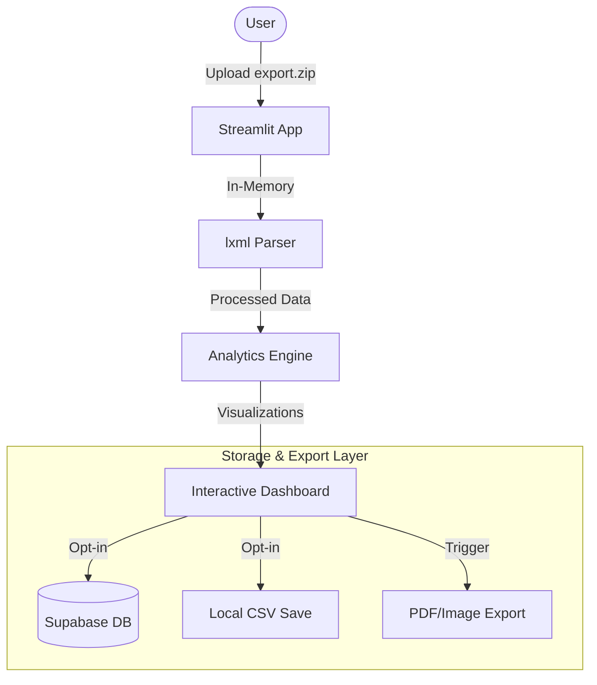

# Architecture & Technical Specification: Apple Watch Running & Health Trend Analysis

## 1. Tech Stack
- **Language:** Python 3.10+
- **Web Framework:** [Streamlit](https://streamlit.io/) (for rapid data app development and interactive UI).
- **Backend/Database:** [Supabase](https://supabase.com/) (PostgreSQL with `supabase-py` for opt-in data persistence).
- **Data Processing:** 
    - `pandas`: Primary engine for time-series manipulation, rolling windows (ACWR), and data aggregation.
    - `numpy`: Numerical operations for algorithm implementation.
- **Parsing & Extraction:**
    - `zipfile`: Handling the `export.zip` archive in-memory using `io.BytesIO`.
    - `lxml`: High-performance XML parsing for the large `export.xml` file.
    - `xml.etree.ElementTree`: Fallback for lightweight XML operations.
- **Visualization:** 
    - `Plotly`: Primary library for interactive, dual-axis charts and gauges.
    - `Altair`: Secondary option for declarative statistical visualizations.

## 2. System Architecture (Pipeline)

### 2.1 Data Flow Diagram

### 2.2 Data Ingestion (Memory-First)
- **Input:** `st.file_uploader` receives the `export.zip`.
- **Processing:** The zip is opened in-memory. `export.xml` is streamed through an `lxml` iterative parser (`iterparse`) to minimize memory footprint for multi-gigabyte exports.

### 2.3 Extraction Layer
- **Record Parsing:** Extract `<Record>` tags for health markers (HRV, RHR, VO2 Max, Sleep).
- **Workout Parsing:** Extract `<Workout>` tags and associated `<WorkoutEvent>` or metadata for Running Dynamics (Power, GCT, etc.).
- **Normalization:** Convert HealthKit units (e.g., `count/min`, `cm`, `W`) to standardized SI units.

### 2.4 Analytics Engine
- **Daily Aggregator:** Groups raw samples into daily metrics.
- **Algorithm Implementation:**
    - **ACWR:** 7-day rolling sum / (28-day rolling average * 7).
    - **Efficiency Factor:** `Average Power / Average Heart Rate` per workout.
    - **TSB Model:** Implementation of the Banister Impulse-Response model (CTL - ATL).

### 2.5 Visualization Layer
- **Component-Based UI:** Modular functions for rendering specific dashboards (Performance, Health, Sleep).
- **State Management:** Use `st.session_state` to cache parsed dataframes across date-filter interactions.

### 2.6 Storage & Export Layer
- **Supabase Integration:** Uses `supabase-py` to store processed summaries (not raw XML) for users who opt-in.
- **Local Export:** Leveraging `st.download_button` for CSV and Plotly's static image export for PDF/PNG/JPEG.

## 3. Privacy & Security
- **Local-by-Default:** Data is never written to disk or a database without explicit user action.
- **Session Isolation:** Each user's data exists only within their unique Streamlit session memory.
- **Opt-in Storage:** User must authenticate and trigger "Save" for any data to persist in Supabase.
- **Client-Side Paradigm:** The server handles data as ephemeral by default.

## 4. Development & Deployment
- **Environment:** `venv` or `conda` with `requirements.txt`.
- **Deployment:** Vercel (via stlite), Google Cloud Run (Dockerized), or GitHub Pages (if stlite).
- **Commands:**
    - Dev: `streamlit run main.py`
    - Dependencies: `pip install streamlit pandas plotly lxml numpy supabase`
